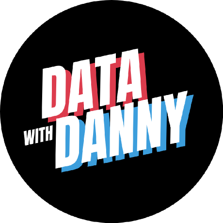

<div align="center">
<h1 align="center">
Data Science
</h3>

[](https://github.com/khuyentran1401/Data-science)  [](https://khuyentran1476.medium.com/) [](https://mathdatasimplified.com/) [](https://www.youtube.com/channel/UCNMawpMow-lW5d2svGhOEbw) 

 
Collection of useful data science topics along with articles and videos.

</div>
 
Subscribe to:
- [My YouTube channel](https://www.youtube.com/@datasciencesimplified) for **videos** related to Python and data sience
- [My Medium newsletter](https://khuyentran1476.medium.com/subscribe) for updates of my **blogs** in your mailbox
- [Data Science Simplified](https://mathdatasimplified.com/) for **bite-sized** Python tips in your mailbox

## How to Download the Code in This Repository to Your Local Machine

To download the code in this repo, you can simply use git clone
```bash
git clone https://github.com/khuyentran1401/Data-science
```

# Contents
1. [MLOps](#mlops)
2. [Testing](#testing)
3. [Productive Tools](#productive-tools)
4. [Python Helper Tools](#python-helper-tools)
5. [Tools for Deployment](#tools-for-deployment)
6. [Speed-up Tools](#speed-up-tools)
7. [Math Tools](#math-tools)
8. [Machine Learning](#machine-learning)
9. [Natural Language Processing](#natural-language-processing)
10. [Computer Vision](#computer-vision)
11. [Time Series](#time-series)
12. [Feature Engineering](#feature-engineering)
13. [Visualization](#visualization)
14. [Mathematical Programming](#mathematical-programming)
15. [Scraping](#scraping)
16. [Python](#python)
17. [Terminal](#terminal)
18. [Linear Algebra](#linear-algebra)
19. [Data Structure](#data-structure)
20. [Statistics](#statistics)
21. [Web Applications](#web-applications)
22. [Share Insights](#share-insights)
23. [Cool Tools](#cool-tools)
24. [Learning Tips](#learning-tips)
25. [Productive Tips](#productive-tips)
26. [VSCode](#vscode)
27. [Book Review](#book-review)
28. [Data Science Portfolio](#data-science-portfolio)

# MLOps

| Title        | Article           | Repository  | Video
| ------------- |:-------------:| :-----:| :-----:|
|Introduction to DVC: Data Version Control Tool for Machine Learning Projects | [🔗](https://towardsdatascience.com/introduction-to-dvc-data-version-control-tool-for-machine-learning-projects-7cb49c229fe0) | [🔗](https://github.com/khuyentran1401/Machine-learning-pipeline) | [🔗](https://youtu.be/80s_dbfiqLM)
| Introduction to Hydra.cc: A Powerful Framework to Configure your Data Science Projects | [🔗](https://towardsdatascience.com/introduction-to-hydra-cc-a-powerful-framework-to-configure-your-data-science-projects-ed65713a53c6) | [🔗](https://github.com/khuyentran1401/hydra_demo) | [🔗](https://www.youtube.com/playlist?list=PLnK6m_JBRVNoPnqnVrWaYtZ2G4nFTnGze)
| Introduction to Weight & Biases: Track and Visualize your Machine Learning Experiments in 3 Lines of Code | [🔗](https://towardsdatascience.com/introduction-to-weight-biases-track-and-visualize-your-machine-learning-experiments-in-3-lines-9c9553b0f99d) | [🔗](https://github.com/khuyentran1401/Data-science/tree/master/data_science_tools/wandb_tracking)
| Kedro — A Python Framework for Reproducible Data Science Project | [🔗](https://towardsdatascience.com/kedro-a-python-framework-for-reproducible-data-science-project-4d44977d4f04) | [🔗](https://github.com/khuyentran1401/kedro_demo)
| Orchestrate a Data Science Project in Python With Prefect | [🔗](https://towardsdatascience.com/orchestrate-a-data-science-project-in-python-with-prefect-e69c61a49074) | [🔗](https://github.com/khuyentran1401/Data-science/tree/master/data_science_tools/prefect_example)
| Orchestrate Your Data Science Project with Prefect 2.0 | [🔗](https://medium.com/the-prefect-blog/orchestrate-your-data-science-project-with-prefect-2-0-4118418fd7ce) | [🔗](https://github.com/khuyentran1401/prefect2-mlops-demo) | [🔗](https://www.youtube.com/playlist?list=PLnK6m_JBRVNrHeLuMMJGtNLmgn3MpXYvq)
| DagsHub: a GitHub Supplement for Data Scientists and ML Engineers | [🔗](https://towardsdatascience.com/dagshub-a-github-supplement-for-data-scientists-and-ml-engineers-9ecaf49cc505) | [🔗](https://dagshub.com/khuyentran1401/dagshub-demo)
| 4 pre-commit Plugins to Automate Code Reviewing and Formatting in Python | [🔗](https://towardsdatascience.com/4-pre-commit-plugins-to-automate-code-reviewing-and-formatting-in-python-c80c6d2e9f5) | [🔗](https://github.com/khuyentran1401/Data-science/tree/master/productive_tools/precommit_examples) | [🔗](https://youtube.com/playlist?list=PLnK6m_JBRVNqskWiXLxx1QRDDng9O8Fsf)
| BentoML: Create an ML Powered Prediction Service in Minutes | [🔗](https://towardsdatascience.com/bentoml-create-an-ml-powered-prediction-service-in-minutes-23d135d6ca76) | [🔗](https://github.com/khuyentran1401/customer_segmentation/tree/bentoml_demo) | [🔗](https://youtu.be/7csscNQnbnI)
| How to Structure a Data Science Project for Readability and Transparency | [🔗](https://towardsdatascience.com/how-to-structure-a-data-science-project-for-readability-and-transparency-360c6716800) | [🔗](https://github.com/khuyentran1401/data-science-template)
| How to Structure an ML Project for Reproducibility and Maintainability | [🔗](https://towardsdatascience.com/how-to-structure-an-ml-project-for-reproducibility-and-maintainability-54d5e53b4c82) | [🔗](https://github.com/khuyentran1401/data-science-template/tree/prefect)
| GitHub Actions in MLOps: Automatically Check and Deploy Your ML Model | [🔗](https://khuyentran1476.medium.com/github-actions-in-mlops-automatically-check-and-deploy-your-ml-model-9a281d7f3c84) | [🔗](https://github.com/khuyentran1401/employee-future-prediction)
| Create Robust Data Pipelines with Prefect, Docker, and GitHub | [🔗](https://towardsdatascience.com/create-robust-data-pipelines-with-prefect-docker-and-github-12b231ca6ed2) | [🔗](https://github.com/khuyentran1401/prefect-docker)
| Create a Maintainable Data Pipeline with Prefect and DVC | [🔗](https://towardsdatascience.com/create-a-maintainable-data-pipeline-with-prefect-and-dvc-1d691ea5bcea) | [🔗](https://github.com/khuyentran1401/prefect-dvc) 
| Build a Full-Stack ML Application With Pydantic And Prefect | [🔗](https://towardsdatascience.com/build-a-full-stack-ml-application-with-pydantic-and-prefect-915f00fe0c62) | [🔗](https://github.com/khuyentran1401/iris-prefect) |  [🔗](https://youtu.be/c-Bqg7Gbuc8)
| DVC + GitHub Actions: Automatically Rerun Modified Components of a Pipeline | [🔗](https://towardsdatascience.com/dvc-github-actions-automatically-rerun-modified-components-of-a-pipeline-a3632519dc42) | [🔗](https://github.com/khuyentran1401/prefect-dvc/tree/dvc-pipeline) | [🔗](https://youtu.be/jZu7LPKIOlY)
| Create Observable and Reproducible Notebooks with Hex | [🔗](https://towardsdatascience.com/create-observable-and-reproducible-notebooks-with-hex-460e75818a09) | [🔗](https://github.com/khuyentran1401/customer_segmentation/tree/prefect2) | [🔗](https://youtu.be/_BjqCrun4nE)
| Build Reliable Machine Learning Pipelines with Continuous Integration | [🔗](https://towardsdatascience.com/build-reliable-machine-learning-pipelines-with-continuous-integration-ea822eb09bf6) | [🔗](https://github.com/khuyentran1401/cicd-mlops-demo) | [🔗](https://youtu.be/rkg09nNMAhs)
| Automate Machine Learning Deployment with GitHub Actions | [🔗](https://towardsdatascience.com/automate-machine-learning-deployment-with-github-actions-f752766981b1) | [🔗](https://github.com/khuyentran1401/cicd-mlops-demo) | [🔗](https://youtu.be/728M0yhI0_M)

# Testing

| Title        | Article           | Repository  |  Video
| ------------- |:-------------:| :-----:| :-----:|
| Pytest for Data Scientists | [🔗](https://towardsdatascience.com/pytest-for-data-scientists-2990319e55e6) | [🔗](https://github.com/khuyentran1401/Data-science/tree/master/data_science_tools/pytest) | [🔗](https://www.youtube.com/playlist?list=PLnK6m_JBRVNoYEer9hBmTNwkYB3gmbOPO)
| 4 Lessor-Known Yet Awesome Tips for Pytest | [🔗](https://towardsdatascience.com/4-lessor-known-yet-awesome-tips-for-pytest-2117d8a62d9c) | [🔗](https://github.com/khuyentran1401/Data-science/tree/master/data_science_tools/advanced_pytest)
| Great Expectations: Always Know What to Expect From Your Data | [🔗](https://towardsdatascience.com/great-expectations-always-know-what-to-expect-from-your-data-51214866c24) | [🔗](https://github.com/khuyentran1401/Data-science/tree/master/data_science_tools/great_expectations_example)
| Validate Your pandas DataFrame with Pandera |  [🔗](https://medium.com/towards-data-science/validate-your-pandas-dataframe-with-pandera-2995910e564) |[🔗](https://github.com/khuyentran1401/Data-science/blob/master/data_science_tools/pandera_example/pandera.ipynb)  | [🔗](https://youtu.be/CB8D7RUM-lI)
| Introduction to Schema: A Python Libary to Validate your Data | [🔗](https://towardsdatascience.com/introduction-to-schema-a-python-libary-to-validate-your-data-c6d99e06d56a) | [🔗](https://deepnote.com/launch?url=https://github.com/khuyentran1401/Data-science/blob/master/data_science_tools/schema.ipynb)
| DeepDiff — Recursively Find and Ignore Trivial Differences Using Python | [🔗](https://towardsdatascience.com/deepdiff-recursively-find-and-ignore-trivial-differences-using-python-231a5524f41d) | [🔗](https://github.com/khuyentran1401/Data-science/blob/master/productive_tools/deepdiff_example.ipynb)
| Checklist — Behavioral Testing of NLP Models | [🔗](https://towardsdatascience.com/checklist-behavioral-testing-of-nlp-models-491cf11f0238) | [🔗](https://github.com/khuyentran1401/Data-science/blob/master/nlp/checklist/checklist_examples.ipynb)
| How to Create Fake Data with Faker | [🔗](https://towardsdatascience.com/how-to-create-fake-data-with-faker-a835e5b7a9d9) | [🔗](https://deepnote.com/launch?url=https://github.com/khuyentran1401/Data-science/blob/master/data_science_tools/faker.ipynb) |
| Detect Defects in a Data Pipeline Early with Validation and Notifications | [🔗](https://towardsdatascience.com/detect-defects-in-a-data-pipeline-early-with-validation-and-notifications-83e9b652e65a) | [🔗](https://github.com/khuyentran1401/prefect2-mlops-demo/tree/deepchecks) | [🔗](https://youtu.be/HdPViOX8Uf8)
| Hypothesis and Pandera: Generate Synthesis Pandas DataFrame for Testing | [🔗](https://towardsdatascience.com/hypothesis-and-pandera-generate-synthesis-pandas-dataframe-for-testing-e5673c7bec2e) | [🔗](https://github.com/khuyentran1401/Data-science/tree/master/data_science_tools/pandera_hypothesis) | [🔗](https://youtu.be/RbW-x_2dFMQ)
| Write Readable Tests for Your Machine Learning Models with Behave | [🔗](https://towardsdatascience.com/write-readable-tests-for-your-machine-learning-models-with-behave-ec4a27b91490) | [🔗](https://github.com/khuyentran1401/Data-science/tree/master/data_science_tools/behave_examples) | [🔗](https://youtu.be/gUttUxyNbIA)

# Productive Tools

| Title        | Article           | Repository  |
| ------------- |:-------------:| :-----:|
| 3 Tools to Track and Visualize the Execution of your Python Code | [🔗](https://towardsdatascience.com/3-tools-to-track-and-visualize-the-execution-of-your-python-code-666a153e435e) | [🔗](https://github.com/khuyentran1401/Data-science/tree/master/python/debug_tools)
| 2 Tools to Automatically Reload when Python Files Change | [🔗](https://towardsdatascience.com/2-tools-to-automatically-reload-when-python-files-change-90bb28139087) | [🔗](https://github.com/khuyentran1401/Data-science/tree/master/terminal/reload_examples)
| 3 Ways to Get Notified with Python | [🔗](https://towardsdatascience.com/how-to-get-a-notification-when-your-training-is-complete-with-python-2d39679d5f0f) | [🔗](https://github.com/khuyentran1401/Data-science/tree/master/python/notification) |
| How to Create Reusable Command-Line | [🔗](https://towardsdatascience.com/how-to-create-reusable-command-line-f9a2bb356bc9) |
| How to Strip Outputs and Execute Interactive Code in a Python Script | [🔗](https://towardsdatascience.com/how-to-strip-outputs-and-execute-interactive-code-in-a-python-script-6d4c5da3beb0) | [🔗](https://github.com/khuyentran1401/Data-science/blob/master/data_science_tools/strip_interactive_example.py)
| Sending Slack Notifications in Python with Prefect| [🔗](https://medium.com/the-prefect-blog/sending-slack-notifications-in-python-with-prefect-840a895f81c) | [🔗](https://github.com/khuyentran1401/Data-science/blob/master/data_science_tools/strip_interactive_example.py)


# Python Helper Tools
| Title        | Article           | Repository  | Video
| ------------- |:-------------:| :-----:| :-----:|
| Pydash: A Kitchen Sink of Missing Python Utilities | [🔗](https://towardsdatascience.com/pydash-a-bucket-of-missing-python-utilities-5d10365be4fc) | [🔗](https://github.com/khuyentran1401/Data-science/blob/master/python/pydash.ipynb) 
| Write Clean Python Code Using Pipes | [🔗](https://towardsdatascience.com/write-clean-python-code-using-pipes-1239a0f3abf5) | [🔗](https://deepnote.com/project/Data-science-hxlyJpi-QrKFJziQgoMSmQ/%2FData-science%2Fproductive_tools%2Fpipe.ipynb) | [🔗](https://youtu.be/K20_eZZGqsc)
| Introducing FugueSQL — SQL for Pandas, Spark, and Dask DataFrames | [🔗](https://towardsdatascience.com/introducing-fuguesql-sql-for-pandas-spark-and-dask-dataframes-63d461a16b27) | [🔗](https://github.com/khuyentran1401/Data-science/blob/master/data_science_tools/fugueSQL.ipynb)
| Fugue and DuckDB: Fast SQL Code in Python | [🔗](https://towardsdatascience.com/fugue-and-duckdb-fast-sql-code-in-python-e2e2dfc0f8eb) | [🔗](https://github.com/khuyentran1401/Data-science/blob/master/productive_tools/Fugue_and_Duckdb/Fugue_and_Duckdb.ipynb)
| Simplify Data Science Workflows on BigQuery with Fugue and Python | [🔗](https://towardsdatascience.com/simplify-data-science-workflows-on-bigquery-with-fugue-and-python-5215a1b65e43) | [🔗](https://github.com/khuyentran1401/Data-science/blob/master/data_science_tools/fugue_bigquery.ipynb)


# Tools for Deployment

| Title        | Article           | Repository  |
| ------------- |:-------------:| :-----:|
| How to Effortlessly Publish your Python Package to PyPI Using Poetry | [🔗](https://towardsdatascience.com/how-to-effortlessly-publish-your-python-package-to-pypi-using-poetry-44b305362f9f) | [🔗](https://github.com/khuyentran1401/pretty-text)
| Typer: Build Powerful CLIs in One Line of Code using Python | [🔗](https://towardsdatascience.com/typer-build-powerful-clis-in-one-line-of-code-using-python-321d9aef3be8) | [🔗](https://github.com/khuyentran1401/Data-science/tree/master/terminal/typer_examples)


# Speed-up Tools

| Title        | Article           | Repository  |
| ------------- |:-------------:| :-----:|
| Cython-A Speed-Up Tool for your Python Function | [🔗](https://towardsdatascience.com/cython-a-speed-up-tool-for-your-python-function-9bab64364bfd) | [🔗](https://github.com/khuyentran1401/Cython) |
| Train your Machine Learning Model 150x Faster with cuML | [🔗](https://towardsdatascience.com/train-your-machine-learning-model-150x-faster-with-cuml-69d0768a047a) | [🔗](https://github.com/khuyentran1401/Data-science/tree/master/machine-learning/cuml)


# Math Tools

| Title        | Article           | Repository  |
| ------------- |:-------------:| :-----:|
| SymPy: Symbolic Computation in Python | [🔗](https://towardsdatascience.com/sympy-symbolic-computation-in-python-f05f1413adb8) | [🔗](https://github.com/khuyentran1401/Data-science/blob/master/data_science_tools/sympy_example.ipynb)


# Machine Learning

| Title        | Article           | Repository  | Video
| ------------- |:-------------:| :-----:| :-----:|
| How to Monitor And Log your Machine Learning Experiment Remotely with HyperDash | [🔗](https://towardsdatascience.com/how-to-monitor-and-log-your-machine-learning-experiment-remotely-with-hyperdash-aa7106b15509) | [🔗](https://github.com/khuyentran1401/Data-science/tree/master/data_science_tools/Hyperdash.ipynb) |
| How to Efficiently Fine-Tune your Machine Learning Models | [🔗](https://towardsdatascience.com/how-to-fine-tune-your-machine-learning-models-with-ease-8ca62d1217b1) | [🔗](https://github.com/khuyentran1401/Machine-learning-pipeline) |
| How to Learn Non-linear Dataset with Support Vector Machines | [🔗](https://towardsdatascience.com/how-to-learn-non-linear-separable-dataset-with-support-vector-machines-a7da21c6d987) | [🔗](https://github.com/khuyentran1401/Data-science/tree/master/machine-learning/SVM_Separate_XOR.ipynb) |
| Introduction to IBM Federated Learning: A Collaborative Approach to Train ML Models on Private Data | [🔗](https://towardsdatascience.com/introduction-to-ibm-federated-learning-a-collaborative-approach-to-train-ml-models-on-private-data-2b4221c3839) | [🔗](https://github.com/IBM/federated-learning-lib)
| 3 Steps to Improve your Efficiency when Hypertuning ML Models | [🔗](https://towardsdatascience.com/3-steps-to-improve-your-efficiency-when-hypertuning-ml-models-5a579d57065e) 
| human-learn: Create a Human Learning Model by Drawing | [🔗](https://towardsdatascience.com/human-learn-create-rules-by-drawing-on-the-dataset-bcbca229f00) | [🔗](https://github.com/khuyentran1401/Data-science/blob/master/machine-learning/human_learn_examples/human-learn%20examples.ipynb)
| Patsy: Build Powerful Features with Arbitrary Python Code | [🔗](https://towardsdatascience.com/patsy-build-powerful-features-with-arbitrary-python-code-bb4bb98db67a#3be4-4bcff97738cd) | [🔗](https://github.com/khuyentran1401/Data-science/blob/master/statistics/patsy_example.ipynb)
| SHAP: Explain Any Machine Learning Model in Python | [🔗](https://towardsdatascience.com/shap-explain-any-machine-learning-model-in-python-24207127cad7) | [🔗](https://deepnote.com/project/Data-science-hxlyJpi-QrKFJziQgoMSmQ/%2FData-science%2Fdata_science_tools%2Fshapey_values%2Fshapey_values.ipynb)
| Predict Movie Ratings with User-Based Collaborative Filtering  | [🔗](https://towardsdatascience.com/predict-movie-ratings-with-user-based-collaborative-filtering-392304b988af) | [🔗](https://github.com/khuyentran1401/Data-science/blob/master/machine-learning/collaborative_filtering/collaborative_filtering.ipynb)
| River: Online Machine Learning in Python | [🔗](https://towardsdatascience.com/river-online-machine-learning-in-python-d0f048120e46) | [🔗](https://github.com/khuyentran1401/Data-science/blob/master/machine-learning/river_streaming/streaming.ipynb) | [🔗](https://youtu.be/2PRqU_uC1hk)
| Human-Learn: Rule-Based Learning as an Alternative to Machine Learning | [🔗](https://towardsdatascience.com/human-learn-rule-based-learning-as-an-alternative-to-machine-learning-baf1899ecb3a) | [🔗](https://github.com/khuyentran1401/Data-science/blob/master/machine-learning/human_learn_examples/rule_based_model.ipynb) | [🔗](https://youtu.be/JF-bC6JYJsw)

# Natural Language Processing

| Title        | Article           | Repository  | Video
| ------------- |:-------------:| :-----:| :-----:|
| Sentiment Analysis of LinkedIn Messages| [🔗](https://towardsdatascience.com/sentiment-analysis-of-linkedin-messages-3bb152307f84) | [🔗](https://github.com/khuyentran1401/Data-science/tree/master/nlp/linkedin_analysis) |
| Find Common Words in Article with Python Module Newspaper and NLTK| [🔗](https://towardsdatascience.com/find-common-words-in-article-with-python-module-newspaper-and-nltk-8c7d6c75733) | [🔗](https://github.com/khuyentran1401/Extract-text-from-article) |
| How to Tokenize Tweets with Python | [🔗](https://towardsdatascience.com/an-introduction-to-tweettokenizer-for-processing-tweets-9879389f8fe7) | [🔗](https://github.com/khuyentran1401/Data-science/tree/master/nlp/tweets_tokenize.ipynb) |
 | How to Solve Analogies with Word2Vec | [🔗](https://towardsdatascience.com/how-to-solve-analogies-with-word2vec-6ebaf2354009) | [🔗](https://github.com/khuyentran1401/Data-science/blob/master//nlp/word2vec.ipynb) |
 | What is PyTorch | [🔗](https://towardsdatascience.com/what-is-pytorch-a84e4559f0e3) | [🔗](https://github.com/khuyentran1401/Data-science/tree/master/nlp/PyTorch.ipynb) |
 | Convolutional Neural Network in Natural Language Processing | [🔗](https://towardsdatascience.com/convolutional-neural-network-in-natural-language-processing-96d67f91275c) | [🔗](https://github.com/khuyentran1401/Data-science/blob/master/nlp/convolutional_neural_network.ipynb) |
 | Supercharge your Python String with TextBlob | [🔗](https://towardsdatascience.com/supercharge-your-python-string-with-textblob-2d9c08a8da05) | [🔗](https://github.com/khuyentran1401/Data-science/blob/master/nlp/textblob.ipynb) | [🔗](https://youtu.be/V--kSO1vV50)
 | pyLDAvis: Topic Modelling Exploration Tool That Every NLP Data Scientist Should Know | [🔗](https://neptune.ai/blog/pyldavis-topic-modelling-exploration-tool-that-every-nlp-data-scientist-should-know) | [🔗](https://github.com/khuyentran1401/Data-science/tree/master/data_science_tools/pyLDAvis)
 | Streamlit and spaCy: Create an App to Predict Sentiment and Word Similarities with Minimal Domain Knowledge | [🔗](https://towardsdatascience.com/streamlit-and-spacy-create-an-app-to-predict-sentiment-and-word-similarities-with-minimal-domain-14085085a5d4) | [🔗](https://github.com/khuyentran1401/Data-science/tree/master/nlp/spacy_streamlit_app)
 | Build a Robust Conversational Assistant with Rasa | [🔗](https://towardsdatascience.com/build-a-conversational-assistant-with-rasa-b410a809572d) | [🔗](https://github.com/khuyentran1401/Data-science/tree/master/nlp/conversational_rasa)
 | I Analyzed 2k Data Scientist and Data Engineer Jobs and This is What I Found | [🔗](https://pub.towardsai.net/i-analyzed-2k-data-scientist-and-data-engineer-jobs-and-this-is-what-i-found-1ed37f98a704) | [🔗](https://github.com/khuyentran1401/Data-science/tree/master/nlp/diffbot_examples)
| Checklist — Behavioral Testing of NLP Models | [🔗](https://towardsdatascience.com/checklist-behavioral-testing-of-nlp-models-491cf11f0238) | [🔗](https://github.com/khuyentran1401/Data-science/blob/master/nlp/checklist/checklist_examples.ipynb)
| PRegEx: Write Human-Readable Regular Expressions in Python | [🔗](https://towardsdatascience.com/pregex-write-human-readable-regular-expressions-in-python-9c87d1b1335) | [🔗](https://github.com/khuyentran1401/Data-science/blob/master/productive_tools/pregex.ipynb)
| Texthero: Text Preprocessing, Representation, and Visualization for a pandas DataFrame | [🔗](https://towardsdatascience.com/texthero-text-preprocessing-representation-and-visualization-for-a-pandas-dataframe-525405af16b6) | [🔗](https://github.com/khuyentran1401/Data-science/tree/master/nlp/texthero)

# Computer Vision

| Title        | Article           | Repository  |
| ------------- |:-------------:| :-----:|
| How to Create an App to Classify Dogs Using fastai and Streamlit | [🔗](https://towardsdatascience.com/how-to-create-an-app-to-classify-dogs-using-fastai-and-streamlit-af3e75f0ee28) | [🔗](https://github.com/khuyentran1401/dog_classifier)

# Time Series

| Title        | Article           | Repository  |
| ------------- |:-------------:| :-----:|
| Kats: a Generalizable Framework to Analyze Time Series Data in Python | [🔗](https://towardsdatascience.com/kats-a-generalizable-framework-to-analyze-time-series-data-in-python-3c8d21efe057) | [🔗](https://github.com/khuyentran1401/Data-science/blob/master/time_series/kats_examples/kats.ipynb)
| How to Detect Seasonality, Outliers, and Changepoints in Your Time Series | [🔗](https://towardsdatascience.com/how-to-detect-seasonality-outliers-and-changepoints-in-your-time-series-5d0901498cff) | [🔗](https://github.com/khuyentran1401/Data-science/blob/master/time_series/google_analytics/google-analytics-analysis.ipynb)
| 4 Tools to Automatically Extract Data from Datetime in Python | [🔗](https://towardsdatascience.com/4-tools-to-automatically-extract-data-from-datetime-in-python-9ecf44943f89) | [🔗](https://github.com/khuyentran1401/Data-science/blob/master/time_series/extract_date_features.ipynb)
 
# Feature Engineering

| Title        | Article           | Repository  | Video
| ------------- |:-------------:| :-----:| :-----:|
| 3 Ways to Extract Features from Dates with Python | [🔗](https://towardsdatascience.com/3-ways-to-extract-features-from-dates-927bd89cd5b9) | [🔗](https://github.com/khuyentran1401/Data-science/blob/master/time_series/extract_features/extract_features_from_dates.ipynb)
| Similarity Encoding for Dirty Categories Using dirty_cat | [🔗](https://towardsdatascience.com/similarity-encoding-for-dirty-categories-using-dirty-cat-d9f0b581a552) | [🔗](https://github.com/khuyentran1401/Data-science/blob/master/feature_engineering/dirty_cat_example/employee_salaries.ipynb)
| Snorkel — A Human-In-The-Loop Platform to Build Training Data | [🔗](https://towardsdatascience.com/snorkel-programmatically-build-training-data-in-python-712fc39649fe) | [🔗](https://github.com/khuyentran1401/Data-science/tree/master/feature_engineering/snorkel_example) | [🔗](https://youtu.be/Prr53wXiHfM)


# Visualization

| Title        | Article           | Repository  | Video
| ------------- |:-------------:| :-----:| :-----:|
| How to Embed Interactive Charts on your Articles and Personal Website | [🔗](https://towardsdatascience.com/how-to-embed-interactive-charts-on-your-medium-articles-and-website-6987f7b28472) | [🔗](https://github.com/khuyentran1401/Data-science/tree/master/data_science_tools/embed_charts.ipynb) |
| What I Learned from Scraping 15k Data Science Articles on Medium      | [🔗](https://medium.com/@khuyentran1476/what-i-learned-from-scraping-15k-data-science-articles-on-medium-98a5f252d0aa) | [🔗](https://github.com/khuyentran1401/Data-science/tree/master/visualization/medium_articles) |
| How to Create Interactive Plots with Altair | [🔗](https://towardsdatascience.com/how-to-create-interactive-and-elegant-plot-with-altair-8dd87a890f2a) | [🔗](https://github.com/khuyentran1401/Data-science/blob/master/visualization/altair/altair.ipynb) |
| How to Create a Drop-Down Menu and a Slide Bar for your Favorite Visualization Tool | [🔗](https://towardsdatascience.com/how-to-create-a-drop-down-menu-and-a-slide-bar-for-your-favorite-visualization-tool-3a50b7c9ea01) | [🔗](https://github.com/khuyentran1401/Data-science/tree/master/visualization/dropdown/dropdown.ipynb) |
| I Scraped more than 1k Top Machine Learning Github Profiles and this is what I Found | [🔗](https://towardsdatascience.com/i-scraped-more-than-1k-top-machine-learning-github-profiles-and-this-is-what-i-found-1ab4fb0c0474) | [🔗](https://github.com/khuyentran1401/Data-science/tree/master/visualization/github)
| Top 6 Python Libraries for Visualization: Which one to Use? | [🔗](https://towardsdatascience.com/top-6-python-libraries-for-visualization-which-one-to-use-fe43381cd658) | [🔗](https://github.com/khuyentran1401/Data-science/tree/master/visualization/top_visualization.ipynb)
| Introduction to Yellowbrick: A Python Library to Visualize the Prediction of your Machine Learning Model | [🔗](https://towardsdatascience.com/introduction-to-yellowbrick-a-python-library-to-explain-the-prediction-of-your-machine-learning-d63ecee10ecc) | [🔗](https://github.com/khuyentran1401/Data-science/tree/master/data_science_tools/Yellowbrick.ipynb)
| Visualize Gender-Specific Tweets with Scattertext | [🔗](https://medium.com/towards-artificial-intelligence/visualize-gender-specific-tweets-with-scattertext-5167e4600025) | [🔗](https://github.com/khuyentran1401/Data-science/tree/master/visualization/scattertext)
| Visualize Your Team’s Projects Using Python Gantt Chart | [🔗](https://towardsdatascience.com/visualize-your-teams-projects-using-python-gantt-chart-5a1c1c98ea35) | [🔗](https://github.com/khuyentran1401/Data-science/blob/master/visualization/gantt_chart/gantt_chart.ipynb)
| How to Create Bindings and Conditions Between Multiple Plots Using Altair | [🔗](https://towardsdatascience.com/how-to-create-bindings-and-conditions-between-multiple-plots-using-altair-4e4fe907de37) | [🔗](https://github.com/khuyentran1401/Data-science/blob/master/visualization/altair/altair_advanced.ipynb)
| How to Sketch your Data Science Ideas With Excalidraw | [🔗](https://towardsdatascience.com/how-to-sketch-your-data-science-ideas-with-excalidraw-a993d049f55c) |
| Pyvis: Visualize Interactive Network Graphs in Python | [🔗](https://towardsdatascience.com/pyvis-visualize-interactive-network-graphs-in-python-77e059791f01) | [🔗](https://github.com/khuyentran1401/Data-science/blob/master/visualization/pyvis_examples/pyvis.ipynb) | [🔗](https://youtu.be/6eQOBuvUPeg)
| Build and Analyze Knowledge Graphs with Diffbot | [🔗](https://towardsdatascience.com/build-and-analyze-knowledge-graphs-with-diffbot-2af83065ade0) 
| Observe The Friend Paradox in Facebook Data Using Python | [🔗](https://towardsdatascience.com/observe-the-friend-paradox-in-facebook-data-using-python-314c23fd49e4#44e7-514613b6bd18) | [🔗](https://github.com/khuyentran1401/Data-science/blob/master/visualization/friend_paradox/facebook_network.ipynb)
| What skills and backgrounds do data scientists have in common? | [🔗](https://www.datacamp.com/community/blog/what-skills-and-backgrounds-do-data-scientists-have-in-common) | [🔗](https://deepnote.com/project/Data-science-hxlyJpi-QrKFJziQgoMSmQ/%2FData-science%2Fvisualization%2Fanalyze_data_science_market%2Fanalyze_data_science_market.ipynb)
| Visualize Similarities Between Companies With Graph Database | [🔗](https://khuyentran1476.medium.com/visualize-similarities-between-companies-with-graph-database-212af872fbf6) | [🔗](https://github.com/khuyentran1401/Data-science/blob/master/visualization/analyze_artificial_intelligence_industry.ipynb)
| Visualize GitHub Social Network with PyGraphistry | [🔗](https://towardsdatascience.com/visualize-github-social-network-with-pygraphistry-dfc23a38ec8d) | [🔗](https://github.com/khuyentran1401/Data-science/blob/master/visualization/visualize_github_network/github_explore.ipynb)
| Find the Top Bootcamps for Data Professionals From Over 5k Profiles | [🔗](https://khuyentran1476.medium.com/find-the-top-bootcamps-for-data-professionals-from-over-5k-profiles-92c38b10ddb4) | [🔗](https://github.com/khuyentran1401/Data-science/tree/master/visualization/ds_bootcamps)
| floWeaver — Turn Flow Data Into a Sankey Diagram In Python | [🔗](https://towardsdatascience.com/floweaver-turn-flow-data-into-a-sankey-diagram-in-python-d166e87dbba#2962-71a0f6581d6d) | [🔗](https://github.com/khuyentran1401/Data-science/blob/master/visualization/floweaver_example/travel.ipynb)
| atoti — Build a BI Platform in Python | [🔗](https://pub.towardsai.net/atoti-build-a-bi-platform-in-python-beea47b92c7b) | [🔗](https://github.com/khuyentran1401/Data-science/blob/master/visualization/atoti_example/atoti.ipynb)
| Analyze and Visualize URLs with Network Graph | [🔗](https://towardsdatascience.com/analyze-and-visualize-urls-with-network-graph-ee3ad5338b69) | [🔗](https://github.com/khuyentran1401/Data-science/blob/master/visualization/analyze_URL/analyze_URL.ipynb)
| statsannotations: Add Statistical Significance Annotations on Seaborn Plots | [🔗](https://towardsdatascience.com/statsannotations-add-statistical-significance-annotations-on-seaborn-plots-6b753346a42a) | [🔗](https://github.com/khuyentran1401/Data-science/blob/master/visualization/statsannotation_example.ipynb) | [🔗](https://youtu.be/z26I6jsdIno)

  
# Mathematical Programming

| Title        | Article           | Repository  |
| ------------- |:-------------:| :-----:|
| How to choose stocks to invest in with Python      | [🔗](https://towardsdatascience.com/choose-stocks-to-invest-with-python-584892e3ad22) | [🔗](https://github.com/khuyentran1401/Data-science/tree/master/mathematical_programming/invest_stock/stock_invest.ipynb) |
| Maximize your Productivity with Python      | [🔗](https://towardsdatascience.com/maximize-your-productivity-with-python-6110004b45f7) | [🔗](https://github.com/khuyentran1401/Task-scheduler-problem/tree/master)
| How to Find a Good Match with Python | [🔗](https://towardsdatascience.com/how-to-match-two-people-with-python-7583b51ff3f9) | [🔗](https://github.com/khuyentran1401/linear-programming-with-PuLP)
| How to Solve a Staff Scheduling Problem with Python | [🔗](https://towardsdatascience.com/how-to-solve-a-staff-scheduling-problem-with-python-63ae50435ba4) | [🔗](https://github.com/khuyentran1401/Data-science/tree/master/mathematical_programming/schedule_workers)
| How to Find Best Locations for your Restaurants with Python | [🔗](https://towardsdatascience.com/how-to-find-best-locations-for-your-restaurants-with-python-b2fadc91c4dd) | [🔗](https://github.com/khuyentran1401/Data-science/tree/master/mathematical_programming/locations_of_stores)
| How to Schedule Flights in Python | [🔗](https://towardsdatascience.com/how-to-schedule-flights-in-python-3357b200db9e) | [🔗](https://github.com/khuyentran1401/Data-science/blob/master/mathematical_programming/schedule_flight_crew/flight_crew_schedule.ipynb)
| How to Solve a Production Planning and Inventory Problem in Python | [🔗](https://towardsdatascience.com/how-to-solve-a-production-planning-and-inventory-problem-in-python-45c546f4bcf0) | [🔗](https://github.com/khuyentran1401/Data-science/blob/master/mathematical_programming/production_and_inventory.ipynb)

# Scraping

| Title        | Article           | Repository  |
| ------------- |:-------------:| :-----:|
| Web Scrape Movie Database with Beautiful Soup      | [🔗](https://medium.com/analytics-vidhya/detailed-tutorials-for-beginners-web-scrap-movie-database-from-multiple-pages-with-beautiful-soup-5836828d23) | [🔗](https://github.com/khuyentran1401/Web-scrape-Ghibli-Movie-Database/tree/master) |
| top-github-scraper: Scrape Top Github Users and Repositories Based On a Keyword in One Line of Code | [🔗](https://khuyentran1476.medium.com/top-github-scraper-scrape-top-github-users-and-repositories-based-on-a-keyword-in-one-line-of-code-d48b29954aac) | [🔗](https://github.com/khuyentran1401/Data-science/blob/master/scraping/scrape_top_github.ipynb)


# Python

| Title        | Article           | Repository  |
| ------------- |:-------------:| :-----:|
| Numpy Tricks for your Data Science Projects| [🔗](https://medium.com/@khuyentran1476/comprehensive-numpy-tutorials-for-beginners-8b88696bd3a2) | [🔗](https://github.com/khuyentran1401/Data-science/tree/master/python/Numpy_tricks.ipynb) |
| Timing for Efficient Python Code | [🔗](https://towardsdatascience.com/timing-the-performance-to-choose-the-right-python-object-for-your-data-science-project-670db6f11b8e) | [🔗](https://github.com/khuyentran1401/Data-science/blob/master//python/Time.ipynb) |
| How to Use Lambda for Efficient Python Code | [🔗](https://towardsdatascience.com/how-to-use-lambda-for-efficient-python-code-ff950dc8d259) | [🔗](https://github.com/khuyentran1401/Data-science/tree/master/python/lambda.ipynb) |
| Python Tricks for Keeping Track of Your Data | [🔗](https://towardsdatascience.com/python-tricks-for-keeping-track-of-your-data-aef3dc817a4e) | [🔗](https://github.com/khuyentran1401/Data-science/tree/master/python/keep_track.ipynb) |
| Boost Your Efficiency With Specialized Dictionary Implementations in Python | [🔗](https://medium.com/better-programming/boost-your-efficiency-with-specialized-dictionary-implementations-7799ec97d14f) | [🔗](https://github.com/khuyentran1401/Data-science/blob/master/python/dictionary.ipynb) |
| Dictionary as an Alternative to If-Else | [🔗](https://towardsdatascience.com/dictionary-as-an-alternative-to-if-else-76fe57a1e4af) | [🔗](https://github.com/khuyentran1401/Data-science/tree/master/python/dictionary_ifelse.ipynb) |
| How to Use Zip to Manipulate a List of Tuples | [🔗](https://levelup.gitconnected.com/how-to-use-zip-to-manipulate-a-list-of-tuples-6ba6e00c02cd) | [🔗](https://github.com/khuyentran1401/Data-science/tree/master/python/zip.ipynb) |
| Get the Most out of Your Array With These Four Numpy Methods | [🔗](https://medium.com/swlh/get-the-most-out-of-your-array-with-these-four-numpy-methods-2fc4a6b04736) | [🔗](https://github.com/khuyentran1401/Data-science/tree/master/python/four_numpy_methods.ipynb)
| 3 Python Tricks to Read, Create, and Run Multiple Files Automatically | [🔗](https://towardsdatascience.com/3-python-tricks-to-read-create-and-run-multiple-files-automatically-5221ebaad2ba) | [🔗](https://github.com/khuyentran1401/Data-science/tree/master/python/python_tricks)
| How to Exclude the Outliers in Pandas DataFrame | [🔗](https://towardsdatascience.com/how-to-exclude-the-outliers-in-pandas-dataframe-c749fca4e091) | [🔗](https://github.com/khuyentran1401/Data-science/blob/master/python/4_pandas_lesser_know_tricks.ipynb)
| Python Clean Code: 6 Best Practices to Make Your Python Functions More Readable | [🔗](https://towardsdatascience.com/python-clean-code-6-best-practices-to-make-your-python-functions-more-readable-7ea4c6171d60) | [🔗](https://github.com/khuyentran1401/Data-science/tree/master/python/good_functions)
| 3 Techniques to Effortlessly Import and Execute Python Modules | [🔗](https://towardsdatascience.com/3-advance-techniques-to-effortlessly-import-and-execute-your-python-modules-ccdcba017b0c) | [🔗](https://github.com/khuyentran1401/Data-science/tree/master/python/module_example)
| Simplify Your Functions with Functools’ Partial and Singledispatch | [🔗](https://towardsdatascience.com/simplify-your-functions-with-functools-partial-and-singledispatch-b7071f7543bb) | [🔗](https://github.com/khuyentran1401/Data-science/blob/master/python/functools%20example.ipynb)


# Terminal

| Title        | Article           | Repository  |
| ------------- |:-------------:| :-----:|
| How to Create and View Interactive Cheatsheets on the Command-line | [🔗](https://towardsdatascience.com/how-to-create-and-view-interactive-cheatsheets-on-the-command-line-6578641039ff) |
| Understand CSV Files from your Terminal with XSV | [🔗](https://towardsdatascience.com/understand-your-csv-files-from-your-terminal-with-xsv-65255ae67293) 
| Prettify your Terminal Text With Termcolor and Pyfiglet| [🔗](https://towardsdatascience.com/prettify-your-terminal-text-with-termcolor-and-pyfiglet-880de83fda6b) | [🔗](https://github.com/khuyentran1401/Data-science/tree/master/python/prettify_terminal_output) |
| Stop Using Print to Debug in Python. Use Icecream Instead | [🔗](https://towardsdatascience.com/stop-using-print-to-debug-in-python-use-icecream-instead-79e17b963fcc) 
| Rich: Generate Rich and Beautiful Text in the Terminal with Python | [🔗](https://towardsdatascience.com/rich-generate-rich-and-beautiful-text-in-the-terminal-with-python-541f39abf32e) | [🔗](https://github.com/khuyentran1401/Data-science/tree/master/terminal/rich)
| Create a Beautiful Dashboard in your Terminal with Wtfutil | [🔗](https://towardsdatascience.com/create-a-beautiful-dashboard-in-your-terminal-with-wtfutil-573424fe3684) | [🔗](https://github.com/khuyentran1401/Data-science/blob/master/terminal/wtf/config.yml)
| 3 Tools to Monitor and Optimize your Linux System | [🔗](https://towardsdatascience.com/3-tools-to-monitor-and-optimize-your-linux-system-c8a46c18d692) 
| Ptpython: A Better Python REPL | [🔗](https://towardsdatascience.com/ptpython-a-better-python-repl-6e21df1eb648) | [🔗](https://gist.github.com/khuyentran1401/b5325ff1f3bfe1e36bf9131a0b8cd388)
| fd: a Simple but Powerful Tool to Find and Execute Files on the Command Line | [🔗](https://towardsdatascience.com/fd-a-simple-but-powerful-tool-to-find-and-execute-files-on-the-command-line-602f9af235ad)
| Speed Up your Command-Line Navigation with These 3 Tools | [🔗](https://towardsdatascience.com/speed-up-your-command-line-navigation-with-these-3-tools-f90105c9aa2b) 
| Python and Data Science Snippets on the Command Line | [🔗](https://towardsdatascience.com/python-and-data-science-snippets-on-the-command-line-2673d5d9e55d) | [🔗](https://github.com/khuyentran1401/Data-science/tree/master/applications/python_snippet_tutorial)


# Statistics

| Title        | Article           | Repository  |
| ------------- |:-------------:| :-----:|
| Can Datasets of a Dinosaur and a Circle have Identical Statistics? | [🔗](https://towardsdatascience.com/how-to-turn-a-dinosaur-dataset-into-a-circle-dataset-with-the-same-statistics-64136c2e2ca0) | [🔗](https://github.com/khuyentran1401/same-stats-different-graphs)
|Introduction to One-Way ANOVA: A Test to Compare the Means between More than Two Groups | [🔗]( https://towardsdatascience.com/introduction-to-one-way-anova-a-test-to-compare-the-means-between-more-than-two-groups-a656cb53b19c)| [🔗](https://github.com/khuyentran1401/Data-science/blob/master/statistics/ANOVA_examples.ipynb)
| Bayes’ Theorem, Clearly Explained with Visualization | [🔗](https://towardsdatascience.com/bayes-theorem-clearly-explained-with-visualization-5083ea5e9b14#5c49-6a7199b5fc13) | [🔗](https://github.com/khuyentran1401/Data-science/blob/master/statistics/bayesian_theorem.ipynb) 
| Detect Change Points with Bayesian Inference and PyMC3 | [🔗](https://towardsdatascience.com/detect-change-points-with-bayesian-inference-and-pymc3-3b4f3ae6b9bb#9530-e5f3d0f86132) | [🔗](https://github.com/khuyentran1401/Data-science/blob/master/statistics/bayesian_example/google%20analytics.ipynb)
| Bayesian Linear Regression with Bambi | [🔗](https://towardsdatascience.com/bayesian-linear-regression-with-bambi-a5e6570f167b) | [🔗](https://github.com/khuyentran1401/Data-science/blob/master/statistics/bayes_linear_regression/linear_regression.ipynb)
| Earn More Salary as a Coder — Higher Degree or More Years of Experience? | [🔗](https://towardsdatascience.com/earn-more-salary-as-a-coder-higher-degree-or-more-years-of-experience-68c13f73a557) | [🔗](https://github.com/khuyentran1401/Data-science/blob/master/statistics/stackoverflow_survey/analyze_salary.ipynb)

# Linear Algebra

| Title        | Article           | Repository  |
| ------------- |:-------------:| :-----:|
| How to Build a Matrix Module from Scratch   | [🔗](https://towardsdatascience.com/how-to-build-a-matrix-module-from-scratch-a4f35ec28b56)   | [🔗](https://github.com/khuyentran1401/Numerical-Optimization-Machine-learning/tree/master/matrix) |
| Linear Algebra for Machine Learning: Solve a System of Linear Equations | [🔗](https://towardsdatascience.com/linear-algebra-for-machine-learning-solve-a-system-of-linear-equations-3ec7e882e10f) | [🔗](https://github.com/khuyentran1401/Numerical-Optimization-Machine-learning/blob/master/Backward%20substitution%20and%20Gaussian%20Elimiation.ipynb) |


# Data Structure

| Title        | Article           | Repository  |
| ------------- |:-------------:| :-----:|
| Convex Hull: An Innovative Approach to Gift-Wrap your Data | [🔗](https://towardsdatascience.com/convex-hull-an-innovative-approach-to-gift-wrap-your-data-899992881efc) | [🔗](https://github.com/khuyentran1401/Computational-Geometry/blob/master/Graham%20Scan.ipynb) |
| How to Visualize Social Network With Graph Theory | [🔗](https://towardsdatascience.com/how-to-visualize-social-network-with-graph-theory-4b2dc0c8a99f) | [🔗](https://github.com/khuyentran1401/Game-of-Thrones-And-Graph) |
| How to Search Data with KDTree | [🔗](https://towardsdatascience.com/how-to-search-data-with-kdtree-aad5c82ebd99) | [🔗](https://github.com/khuyentran1401/kdtree-implementation) |
| How to Find the Nearest Hospital with a Voronoi Diagram | [🔗](https://towardsdatascience.com/how-to-find-the-nearest-hospital-with-voronoi-diagram-63bd6d0b7b75) | [🔗](https://github.com/khuyentran1401/Voronoi-diagram/)


# Web Applications

| Title        | Article           | Repository  |
| ------------- |:-------------:| :-----:|
| How to Create an Interactive Startup Growth Calculator with Python | [🔗](https://towardsdatascience.com/how-to-create-an-interactive-startup-growth-calculator-with-python-d224816f29d5) | [🔗](https://github.com/datapane/gallery/tree/master/startup-calculator)
| Streamlit and spaCy: Create an App to Predict Sentiment and Word Similarities with Minimal Domain Knowledge | [🔗](https://towardsdatascience.com/streamlit-and-spacy-create-an-app-to-predict-sentiment-and-word-similarities-with-minimal-domain-14085085a5d4) | [🔗](https://github.com/khuyentran1401/Data-science/tree/master/nlp/spacy_streamlit_app)
| PyWebIO: Write Interactive Web App in Script Way Using Python | [🔗](https://towardsdatascience.com/pywebio-write-interactive-web-app-in-script-way-using-python-14f50155af4e) | [🔗](https://github.com/khuyentran1401/Data-science/tree/master/applications/pywebio_examples)
| PyWebIO 1.3.0: Add Tabs, Pin Input, and Update an Input Based on Another Input | [🔗](https://towardsdatascience.com/pywebio-1-3-0-add-tabs-pin-input-and-update-an-input-based-on-another-input-e81a139fefcb) | [🔗](https://github.com/khuyentran1401/Data-science/tree/master/applications/pywebio_1_3_0)
| Create an App to Deal with Boredom Using PyWebIO | [🔗](https://towardsdatascience.com/create-an-app-to-deal-with-boredom-using-pywebio-d17f3acd1613) | [🔗](https://build.pyweb.io/get/khuyentran1401/bored_app)
| Build a Robust Workflow to Visualize Trending GitHub Repositories in Python | [🔗](https://towardsdatascience.com/build-a-robust-workflow-to-visualize-trending-github-repositories-in-python-98f2fc3e9a86) | [🔗](https://github.com/khuyentran1401/analyze_github_feed)

# Share Insights

| Title        | Article           | Repository  |
| ------------- |:-------------:| :-----:|
| Introduction to Datapane: A Python Library to Build Interactive Reports | [🔗](https://towardsdatascience.com/introduction-to-datapane-a-python-library-to-build-interactive-reports-4593fd3cb9c8) | 
| Datapane’s New Features: Create a Beautiful Dashboard in Python in a Few Lines of Code | [🔗](https://towardsdatascience.com/datapanes-new-features-create-a-beautiful-dashboard-in-python-in-a-few-lines-of-code-a3c44523292b) | [🔗](https://github.com/khuyentran1401/Data-science/tree/master/data_science_tools/Datapane_new_features)
| Introduction to Datasette: Explore and Publish Your Data in One Line of Code | [🔗](https://towardsdatascience.com/introduction-to-datasette-explore-and-publish-your-data-in-one-line-of-code-cbdc40cb4583)
| How to Share your Python Objects Across Different Environments in One Line of Code | [🔗](https://towardsdatascience.com/how-to-share-your-python-objects-across-different-environments-in-one-line-of-code-f30a25e5f50e)  | [🔗](https://github.com/khuyentran1401/Data-science/tree/master/data_science_tools/blob_datapane.ipynb) |
| How to Share your Jupyter Notebook in 3 Lines of Code with Ngrok | [🔗](https://towardsdatascience.com/how-to-share-your-jupyter-notebook-in-3-lines-of-code-with-ngrok-bfe1495a9c0c) |
| Introduction to Deepnote: Real-time Collaboration on Jupyter Notebook | [🔗](https://pub.towardsai.net/introduction-to-deepnote-real-time-collaboration-on-jupyter-notebook-18509c95d62f)

# Cool Tools

| Title        | Article           | Repository  |
| ------------- |:-------------:| :-----:|
| Simulate Real-life Events in Python Using SimPy | [🔗](https://towardsdatascience.com/simulate-real-life-events-in-python-using-simpy-e6d9152a102f) | [🔗](https://github.com/khuyentran1401/Data-science/tree/master/applications/simpy_examples)
| How to Create Mathematical Animations like 3Blue1Brown Using Python |[🔗](https://towardsdatascience.com/how-to-create-mathematical-animations-like-3blue1brown-using-python-f571fb9da3d1) | [🔗](https://github.com/khuyentran1401/Data-science/tree/master/visualization/manim_exp)

# Learning Tips

| Title        | Article           | Repository  |
| ------------- |:-------------:| :-----:|
| How to Learn Data Science when Life does not Give You a Break | [🔗](https://towardsdatascience.com/how-to-learn-data-science-when-life-does-not-give-you-a-break-a26a6ea328fd) |
| How to Accelerate your Data Science Career by Putting yourself in the Right Environment | [🔗](https://towardsdatascience.com/how-to-accelerate-your-data-science-career-by-putting-yourself-in-the-right-environment-8316f42a476c) |
| To become a Better Data Scientist, you need to Think like a Programmer | [🔗](https://towardsdatascience.com/to-become-a-better-data-scientist-you-need-to-think-like-a-programmer-18d0a00994dc) | 
| How not to be Overwhelmed with Data Science | [🔗](https://towardsdatascience.com/how-not-to-be-overwhelmed-with-data-science-5a95ff1618f8)

# Productive Tips

| Title        | Article           | Repository  |
| ------------- |:-------------:| :-----:|
| How to Organize your Data Science Articles with Github | [🔗](https://towardsdatascience.com/how-to-organize-your-data-science-articles-with-github-b5b9427dad37) | [🔗](https://github.com/khuyentran1401/machine-learning-articles) |
| 5 Reasons why you should Switch from Jupyter Notebook to Scripts | [🔗](https://towardsdatascience.com/5-reasons-why-you-should-switch-from-jupyter-notebook-to-scripts-cb3535ba9c95) |
| 7 Reasons Why you Should Start Documenting your Code | [🔗](https://towardsdatascience.com/7-reasons-why-you-should-start-documenting-your-code-48c2096de6a7)


# VSCode

| Title        | Article           | Repository  |
| ------------- |:-------------:| :-----:|
| How to Leverage Visual Studio Code for your Data Science Projects | [🔗](https://towardsdatascience.com/how-to-leverage-visual-studio-code-for-your-data-science-projects-7078b70a72f0) | 
| Top 4 Code Viewers for Data Scientist in VSCode | [🔗](https://towardsdatascience.com/top-4-code-viewers-for-data-scientist-in-vscode-e275e492350d) |
| Incorporate the Best Practices for Python with These Top 4 VSCode Extensions | [🔗](https://towardsdatascience.com/incorporate-the-best-practices-for-python-with-these-top-4-vscode-extensions-3101177c23a9)
| Boost Your Efficiency with Customized Code Snippets on VSCode | [🔗](https://towardsdatascience.com/how-to-boost-your-efficiency-with-customized-code-snippets-on-vscode-8127781788d7) |
| Top 9 Keyboard Shortcuts in VSCode for Data Scientists | [🔗](https://towardsdatascience.com/top-9-keyboard-shortcuts-in-vscode-for-data-scientists-468691b65ebe) |


# Book Review

| Title        | Article           | Repository  |
| ------------- |:-------------:| :-----:|
| Python Machine Learning: A Comprehensive Handbook for Machine Learning | [🔗](https://medium.com/analytics-vidhya/python-machine-learning-a-comprehensive-handbook-for-machine-learning-63f024c898d0) |


# Data Science Portfolio

| Title        | Article           | Repository  |
| ------------- |:-------------:| :-----:|
| How to Create an Elegant Website for your Data Science Portfolio in 10 minutes | [🔗](https://towardsdatascience.com/how-to-create-an-elegant-website-for-your-data-science-portfolio-in-10-minutes-577f77d1f693)| 
| Build an Impressive Github Profile in 3 Steps | [🔗](https://towardsdatascience.com/build-an-impressive-github-profile-in-3-steps-f1938957d480)


# Supporters
Special thanks to these supporters for supporting this project!

[](https://github.com/DataWithDanny) [](https://www.linkedin.com/in/sagar-ravindra-sonawane/)


